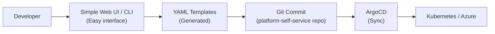
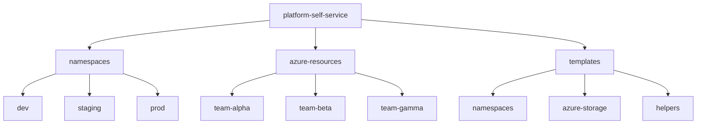

# LAB04A: Self-Service Platform UI with Simple Web Forms

Welcome to LAB04A! In this lab, you'll add a lightweight developer portal to provide a user-friendly interface for your platform. By the end of this lab, you'll have:

- A simple, reliable web-based form interface for requesting resources
- Pre-built YAML templates for namespaces and Azure resources
- Command-line tools for easy resource requests
- Integration with your platform-self-service repository from LAB02
- A complete self-service workflow where ArgoCD syncs requested resources

**Note**: This lab provides practical, workshop-friendly alternatives to complex developer portals like Backstage, focusing on simplicity and reliability for local development environments.

## Prerequisites

Before starting, ensure you have completed:
- ✅ **LAB01**: Kind cluster with NGINX ingress and ArgoCD installed
- ✅ **LAB02**: Platform-self-service repository and ArgoCD ApplicationSets
- ✅ **LAB03**: Azure Service Operator installed (for Azure resource templates)

**Additional Requirements:**
- ✅ **kubectl**: Command-line tool for Kubernetes
- ✅ **Git**: For committing and pushing resource requests
- ✅ **GitHub Account**: Your platform-self-service repository from LAB02
- ✅ **curl or web browser**: For accessing the simple web UI

## Overview

In previous labs, you created a GitOps-based self-service platform where teams request resources through Git Pull Requests. While powerful, this approach requires developers to:
- Understand Git workflows
- Write YAML manifests correctly
- Wait for PR reviews and merges

In this lab, we'll add **simple, reliable self-service tools** that:
- Provide easy-to-use interfaces instead of complex YAML editing
- Generate correct YAML from templates automatically
- Integrate with your existing GitOps workflow
- Work reliably in workshop and local development environments

### Why Not Backstage?

While Backstage is a powerful platform for production environments, it has challenges in workshop settings:
- Complex installation and configuration
- Heavy resource requirements (Node.js, databases, etc.)
- Requires extensive setup time
- Can be unreliable in local Kind clusters
- Steep learning curve for workshop timeframes

### Alternative Approaches

This lab explores three practical, workshop-friendly alternatives that capture the essence of self-service:

1. **Simple Web UI**: Lightweight HTML forms hosted in your cluster
2. **Command-Line Helper**: Bash scripts that generate YAML from prompts
3. **YAML Templates**: Pre-built templates with simple parameter substitution

All three approaches integrate seamlessly with your GitOps workflow from LAB02.

### Lab Architecture


### Lab Flow

1. Set up YAML templates for common resource requests
2. Deploy a simple web UI for form-based requests (Option A)
3. Create command-line helper scripts (Option B)
4. Test the complete workflow: Request → Generate → Commit → Sync → Deployed
5. Compare approaches and choose what works best for your team

## Part 1: Setting Up YAML Templates

Instead of complex form builders, we'll create reusable YAML templates that developers can easily customize. This is lightweight, version-controlled, and requires no special infrastructure.

### Prepare Your Platform Repository

First, ensure you have your platform-self-service repository from LAB02:

```bash
# Navigate to your platform-self-service repository
cd ~/platform-self-service

# If you don't have it, clone it
# git clone https://github.com/YOUR_USERNAME/platform-self-service.git
# cd platform-self-service

# Verify you're in the right place
ls -la
# Should show your namespaces/ and azure-resources/ directories from LAB02
```

### Create Template Directory Structure

```bash
# Create a templates directory
mkdir -p templates/namespaces
mkdir -p templates/azure-storage
mkdir -p templates/helpers

# Verify the structure matches the expected layout for azure-resources
# Azure resources should be organized by team: azure-resources/{teamname}/*.yaml
mkdir -p azure-resources/example-team

```

### Create Namespace Request Template

Create a template that developers can easily customize:

```bash
cat << 'EOF' > templates/namespaces/namespace-template.yaml
# Kubernetes Namespace Request Template
#
# Instructions:
# 1. Copy this file to: namespaces/{environment}/{your-team}-namespace.yaml
# 2. Replace all {{PLACEHOLDERS}} with your values
# 3. Commit and push to create a PR
# 4. After PR approval and merge, ArgoCD will create your namespace
#
# Example values:
#   TEAM_NAME: frontend, backend, data-team
#   ENVIRONMENT: dev, staging, prod
#   CONTACT_EMAIL: team@company.com
#   PURPOSE: Application deployment, testing, etc.
#   CPU_CORES: 1, 2, 4, 8
#   MEMORY_GB: 2, 4, 8, 16

---
apiVersion: v1
kind: Namespace
metadata:
  name: devops-{{TEAM_NAME}}-{{ENVIRONMENT}}
  labels:
    team: {{TEAM_NAME}}
    environment: {{ENVIRONMENT}}
    managed-by: platform-team
    created-via: self-service
  annotations:
    team.contact: "{{CONTACT_EMAIL}}"
    purpose: "{{PURPOSE}}"
    requested-date: "{{DATE}}"
---
apiVersion: v1
kind: ResourceQuota
metadata:
  name: {{TEAM_NAME}}-{{ENVIRONMENT}}-quota
  namespace: devops-{{TEAM_NAME}}-{{ENVIRONMENT}}
spec:
  hard:
    requests.cpu: "{{CPU_CORES}}"
    requests.memory: "{{MEMORY_GB}}Gi"
    limits.cpu: "{{CPU_CORES * 2}}"
    limits.memory: "{{MEMORY_GB * 2}}Gi"
    persistentvolumeclaims: "5"
    services: "10"
    pods: "20"
---
apiVersion: v1
kind: LimitRange
metadata:
  name: {{TEAM_NAME}}-{{ENVIRONMENT}}-limits
  namespace: devops-{{TEAM_NAME}}-{{ENVIRONMENT}}
spec:
  limits:
  - default:
      cpu: 500m
      memory: 512Mi
    defaultRequest:
      cpu: 100m
      memory: 128Mi
    type: Container
EOF

echo "✅ Created namespace template"
```

### Create Azure Storage Template

```bash
cat << 'EOF' > templates/azure-storage/storage-template.yaml
# Azure Storage Account Request Template
#
# Instructions:
# 1. Copy this file to: azure-resources/{your-team-name}/{your-storage-name}.yaml
# 2. Replace all {{PLACEHOLDERS}} with your values
# 3. Commit and push to create a PR
# 4. After PR approval and merge, ArgoCD and ASO will create your storage account
#
# Example values:
#   TEAM_NAME: frontend, backend, data-team
#   ENVIRONMENT: dev, staging, prod
#   STORAGE_NAME: myteamstorage001 (must be globally unique, 3-24 chars, lowercase alphanumeric only)
#   PURPOSE: Application data, backups, etc.
#   AZURE_REGION: swedencentral, westeurope, northeurope
#   SKU: Standard_LRS (local), Standard_GRS (geo-redundant)

---
# Resource Group for Storage
apiVersion: resources.azure.com/v1api20200601
kind: ResourceGroup
metadata:
  name: {{TEAM_NAME}}-{{ENVIRONMENT}}-storage-rg
  namespace: default
spec:
  location: {{AZURE_REGION}}
  tags:
    team: {{TEAM_NAME}}
    environment: {{ENVIRONMENT}}
    resource-type: storage
    managed-by: platform-team
    created-via: self-service
    requested-date: "{{DATE}}"
---
# Storage Account
apiVersion: storage.azure.com/v1api20230101
kind: StorageAccount
metadata:
  name: {{STORAGE_NAME}}
  namespace: default
spec:
  location: {{AZURE_REGION}}
  kind: StorageV2
  sku:
    name: {{SKU}}
  owner:
    name: {{TEAM_NAME}}-{{ENVIRONMENT}}-storage-rg
  accessTier: Hot
  tags:
    team: {{TEAM_NAME}}
    environment: {{ENVIRONMENT}}
    purpose: "{{PURPOSE}}"
    managed-by: platform-team
    created-via: self-service
EOF

echo "✅ Created Azure storage template"
```

### Create README for Templates

```bash
cat << 'EOF' > templates/README.md
# Self-Service Platform Templates

This directory contains templates for requesting platform resources. Developers use these templates to quickly generate properly formatted resource requests.

## Available Templates

### Namespace Request (`namespaces/namespace-template.yaml`)
Request a Kubernetes namespace with resource quotas and limits.

**Required values:**
- `TEAM_NAME`: Your team name (lowercase, no spaces)
- `ENVIRONMENT`: dev, staging, or prod
- `CONTACT_EMAIL`: Team contact email
- `PURPOSE`: What the namespace will be used for
- `CPU_CORES`: Number of CPU cores (1, 2, 4, 8)
- `MEMORY_GB`: Memory in GB (2, 4, 8, 16)
- `DATE`: Request date (YYYY-MM-DD)

### Azure Storage Request (`azure-storage/storage-template.yaml`)
Request an Azure Storage Account for your team.

**Required values:**
- `TEAM_NAME`: Your team name
- `ENVIRONMENT`: dev, staging, or prod
- `STORAGE_NAME`: Globally unique storage name (3-24 chars, lowercase alphanumeric)
- `PURPOSE`: What the storage will be used for
- `AZURE_REGION`: swedencentral, westeurope, or northeurope
- `SKU`: Standard_LRS or Standard_GRS
- `DATE`: Request date (YYYY-MM-DD)

**File Location**: `azure-resources/{TEAM_NAME}/{STORAGE_NAME}.yaml`

## How to Use Templates

### Manual Method
1. Copy the appropriate template file
2. Replace all `{{PLACEHOLDERS}}` with your actual values
3. Save to the correct directory
4. Commit and push to create a PR
5. Wait for PR approval and merge
6. ArgoCD will automatically sync the resources

### Using Helper Scripts (see Part 2)
Use the provided scripts to interactively generate YAML from templates.

## Directory Structure



**Note**: Azure resources are organized by team name under `azure-resources/`, where each team has their own directory containing their YAML resource definitions.

## Support

For questions or issues, contact the platform team or consult LAB04A documentation.
EOF

echo "✅ Created templates README"
```

### ✅ Verification Steps - Part 1

```bash
# Verify template structure
ls -la templates/
ls -la templates/namespaces/
ls -la templates/azure-storage/

# View the templates
cat templates/namespaces/namespace-template.yaml
cat templates/azure-storage/storage-template.yaml

# Commit templates to repository
git add templates/
git commit -m "Add self-service YAML templates for namespaces and Azure storage"
git push origin main
```

**Expected Output:**
- Templates directory created with proper structure
- Namespace and storage templates contain placeholder syntax
- Templates committed to Git repository
- README explains how to use templates

## Part 2: Command-Line Helper Scripts (Option A)

The simplest self-service approach is an interactive command-line script that generates YAML from templates. This requires no infrastructure and works everywhere.

### Create the Namespace Request Script

```bash
cat << 'EOF' > templates/helpers/request-namespace.sh
#!/bin/bash
# Interactive script to request a Kubernetes namespace
# This script generates YAML from templates and can optionally commit it

set -e

echo "==================================="
echo "   Namespace Request Tool"
echo "==================================="
echo

# Prompt for values
read -p "Team Name (lowercase, no spaces): " TEAM_NAME
read -p "Environment (dev/staging/prod): " ENVIRONMENT
read -p "Contact Email: " CONTACT_EMAIL
read -p "Purpose: " PURPOSE
read -p "CPU Cores (1/2/4/8): " CPU_CORES
read -p "Memory GB (2/4/8/16): " MEMORY_GB

# Calculate limits (double the requests)
CPU_LIMIT=$((CPU_CORES * 2))
MEMORY_LIMIT=$((MEMORY_GB * 2))

# Get current date
DATE=$(date +%Y-%m-%d)

# Generate YAML
OUTPUT_DIR="../namespaces/${ENVIRONMENT}"
OUTPUT_FILE="${OUTPUT_DIR}/${TEAM_NAME}-namespace.yaml"

# Create directory if it doesn't exist
mkdir -p "$OUTPUT_DIR"

echo
echo "Generating YAML file: $OUTPUT_FILE"
echo

# Generate the YAML file
cat > "$OUTPUT_FILE" << YAML
# Kubernetes Namespace Request
# Team: ${TEAM_NAME}
# Environment: ${ENVIRONMENT}
# Requested: ${DATE}
---
apiVersion: v1
kind: Namespace
metadata:
  name: devops-${TEAM_NAME}-${ENVIRONMENT}
  labels:
    team: ${TEAM_NAME}
    environment: ${ENVIRONMENT}
    managed-by: platform-team
    created-via: self-service
  annotations:
    team.contact: "${CONTACT_EMAIL}"
    purpose: "${PURPOSE}"
    requested-date: "${DATE}"
---
apiVersion: v1
kind: ResourceQuota
metadata:
  name: ${TEAM_NAME}-${ENVIRONMENT}-quota
  namespace: devops-${TEAM_NAME}-${ENVIRONMENT}
spec:
  hard:
    requests.cpu: "${CPU_CORES}"
    requests.memory: "${MEMORY_GB}Gi"
    limits.cpu: "${CPU_LIMIT}"
    limits.memory: "${MEMORY_LIMIT}Gi"
    persistentvolumeclaims: "5"
    services: "10"
    pods: "20"
---
apiVersion: v1
kind: LimitRange
metadata:
  name: ${TEAM_NAME}-${ENVIRONMENT}-limits
  namespace: devops-${TEAM_NAME}-${ENVIRONMENT}
spec:
  limits:
  - default:
      cpu: 500m
      memory: 512Mi
    defaultRequest:
      cpu: 100m
      memory: 128Mi
    type: Container
YAML

echo "✅ YAML file generated successfully!"
echo
echo "File location: $OUTPUT_FILE"
echo
echo "Namespace that will be created: devops-${TEAM_NAME}-${ENVIRONMENT}"
echo

# Show the file contents
cat "$OUTPUT_FILE"

echo
echo "=================================="
echo "Next Steps:"
echo "=================================="
echo "1. Review the generated YAML above"
echo "2. Commit the file to git:"
echo "   cd $(dirname $OUTPUT_DIR)"
echo "   git add $OUTPUT_FILE"
echo "   git commit -m 'Request namespace for ${TEAM_NAME} ${ENVIRONMENT}'"
echo "   git push origin main"
echo "3. Create a Pull Request on GitHub"
echo "4. After PR approval, ArgoCD will sync the namespace"
echo

read -p "Would you like to commit this file now? (y/n): " COMMIT_NOW

if [[ "$COMMIT_NOW" == "y" || "$COMMIT_NOW" == "Y" ]]; then
    cd "$(dirname $OUTPUT_DIR)"
    git add "$OUTPUT_FILE"
    git commit -m "Request namespace for ${TEAM_NAME} in ${ENVIRONMENT} environment

Requested by: ${CONTACT_EMAIL}
Purpose: ${PURPOSE}
Resources: ${CPU_CORES} CPU cores, ${MEMORY_GB}GB memory"

    echo
    echo "✅ Changes committed locally!"
    echo "Run 'git push origin main' to push to GitHub and create a PR"
fi

echo
echo "Done!"
EOF

# Make script executable
chmod +x templates/helpers/request-namespace.sh

echo "✅ Created namespace request script"
```

### Create the Azure Storage Request Script

```bash
cat << 'EOF' > templates/helpers/request-storage.sh
#!/bin/bash
# Interactive script to request Azure Storage Account
# This script generates YAML from templates and can optionally commit it

set -e

echo "==================================="
echo "   Azure Storage Request Tool"
echo "==================================="
echo

# Prompt for values
read -p "Team Name: " TEAM_NAME
read -p "Environment (dev/staging/prod): " ENVIRONMENT
read -p "Storage Account Name (3-24 chars, lowercase alphanumeric only): " STORAGE_NAME
read -p "Purpose: " PURPOSE
read -p "Azure Region (swedencentral/westeurope/northeurope): " AZURE_REGION
read -p "SKU (Standard_LRS/Standard_GRS): " SKU

# Validate storage name
if [[ ! "$STORAGE_NAME" =~ ^[a-z0-9]{3,24}$ ]]; then
    echo "❌ Error: Storage name must be 3-24 characters, lowercase alphanumeric only"
    exit 1
fi

# Get current date
DATE=$(date +%Y-%m-%d)

# Generate YAML
OUTPUT_DIR="../azure-resources/${TEAM_NAME}"
OUTPUT_FILE="${OUTPUT_DIR}/${STORAGE_NAME}.yaml"

# Create directory if it doesn't exist
mkdir -p "$OUTPUT_DIR"

echo
echo "Generating YAML file: $OUTPUT_FILE"
echo

# Generate the YAML file
cat > "$OUTPUT_FILE" << YAML
# Azure Storage Account Request
# Team: ${TEAM_NAME}
# Environment: ${ENVIRONMENT}
# Requested: ${DATE}
---
# Resource Group for Storage
apiVersion: resources.azure.com/v1api20200601
kind: ResourceGroup
metadata:
  name: ${TEAM_NAME}-${ENVIRONMENT}-storage-rg
  namespace: default
spec:
  location: ${AZURE_REGION}
  tags:
    team: ${TEAM_NAME}
    environment: ${ENVIRONMENT}
    resource-type: storage
    managed-by: platform-team
    created-via: self-service
    requested-date: "${DATE}"
---
# Storage Account
apiVersion: storage.azure.com/v1api20230101
kind: StorageAccount
metadata:
  name: ${STORAGE_NAME}
  namespace: default
spec:
  location: ${AZURE_REGION}
  kind: StorageV2
  sku:
    name: ${SKU}
  owner:
    name: ${TEAM_NAME}-${ENVIRONMENT}-storage-rg
  accessTier: Hot
  tags:
    team: ${TEAM_NAME}
    environment: ${ENVIRONMENT}
    purpose: "${PURPOSE}"
    managed-by: platform-team
    created-via: self-service
YAML

echo "✅ YAML file generated successfully!"
echo
echo "File location: $OUTPUT_FILE"
echo
echo "Storage account name: ${STORAGE_NAME}"
echo "Resource group: ${TEAM_NAME}-${ENVIRONMENT}-storage-rg"
echo

# Show the file contents
cat "$OUTPUT_FILE"

echo
echo "=================================="
echo "Next Steps:"
echo "=================================="
echo "1. Review the generated YAML above"
echo "2. Commit the file to git:"
echo "   cd $(dirname $OUTPUT_DIR)"
echo "   git add $OUTPUT_FILE"
echo "   git commit -m 'Request storage account ${STORAGE_NAME}'"
echo "   git push origin main"
echo "3. Create a Pull Request on GitHub"
echo "4. After PR approval, ArgoCD and ASO will create the storage account"
echo

read -p "Would you like to commit this file now? (y/n): " COMMIT_NOW

if [[ "$COMMIT_NOW" == "y" || "$COMMIT_NOW" == "Y" ]]; then
    cd "$(dirname $OUTPUT_DIR)"
    git add "$OUTPUT_FILE"
    git commit -m "Request Azure storage account ${STORAGE_NAME}

Team: ${TEAM_NAME}
Environment: ${ENVIRONMENT}
Purpose: ${PURPOSE}
Region: ${AZURE_REGION}
SKU: ${SKU}"

    echo
    echo "✅ Changes committed locally!"
    echo "Run 'git push origin main' to push to GitHub and create a PR"
fi

echo
echo "Done!"
EOF

# Make script executable
chmod +x templates/helpers/request-storage.sh

echo "✅ Created storage request script"
```

### Test the Scripts

Let's test the namespace request script:

```bash
# Navigate to the helpers directory
cd templates/helpers

# Run the script interactively
./request-namespace.sh

# Example input:
# Team Name: testteam
# Environment: dev
# Contact Email: testteam@company.com
# Purpose: Testing self-service workflow
# CPU Cores: 2
# Memory GB: 4
# Commit now: n (for now, we'll review first)
```

### ✅ Verification Steps - Part 2

```bash
# Verify scripts were created
ls -la templates/helpers/
file templates/helpers/request-namespace.sh
file templates/helpers/request-storage.sh

# Check scripts are executable
[[ -x templates/helpers/request-namespace.sh ]] && echo "✅ Namespace script is executable"
[[ -x templates/helpers/request-storage.sh ]] && echo "✅ Storage script is executable"

# Commit the helper scripts
cd ~/platform-self-service
git add templates/helpers/
git commit -m "Add interactive CLI helper scripts for self-service"
git push origin main
```

**Expected Output:**
- Two executable shell scripts created
- Scripts have proper permissions
- Scripts committed to repository

## Part 3: Simple Web UI (Option B)

For teams that prefer a web interface, we can deploy a lightweight HTML form that generates YAML. For the purposes of this lab, we'll create a static HTML file that can be served via a simple web server or ingress.

### Create the Web UI

```bash
cat << 'EOF' > templates/helpers/self-service-ui.html
<!DOCTYPE html>
<html lang="en">
<head>
    <meta charset="UTF-8">
    <meta name="viewport" content="width=device-width, initial-scale=1.0">
    <title>Platform Self-Service Portal</title>
    <style>
        * {
            margin: 0;
            padding: 0;
            box-sizing: border-box;
        }
        body {
            font-family: -apple-system, BlinkMacSystemFont, 'Segoe UI', Roboto, Oxygen, Ubuntu, Cantarell, sans-serif;
            background: linear-gradient(135deg, #667eea 0%, #764ba2 100%);
            min-height: 100vh;
            padding: 20px;
        }
        .container {
            max-width: 800px;
            margin: 0 auto;
            background: white;
            border-radius: 10px;
            box-shadow: 0 20px 60px rgba(0,0,0,0.3);
            overflow: hidden;
        }
        header {
            background: #2d3748;
            color: white;
            padding: 30px;
            text-align: center;
        }
        h1 {
            font-size: 28px;
            margin-bottom: 10px;
        }
        .subtitle {
            color: #a0aec0;
            font-size: 14px;
        }
        .tabs {
            display: flex;
            background: #edf2f7;
            border-bottom: 2px solid #cbd5e0;
        }
        .tab {
            flex: 1;
            padding: 15px;
            text-align: center;
            cursor: pointer;
            background: #edf2f7;
            border: none;
            font-size: 16px;
            font-weight: 600;
            color: #4a5568;
            transition: all 0.3s;
        }
        .tab:hover {
            background: #e2e8f0;
        }
        .tab.active {
            background: white;
            color: #667eea;
            border-bottom: 3px solid #667eea;
        }
        .tab-content {
            display: none;
            padding: 30px;
        }
        .tab-content.active {
            display: block;
        }
        .form-group {
            margin-bottom: 20px;
        }
        label {
            display: block;
            margin-bottom: 5px;
            font-weight: 600;
            color: #2d3748;
        }
        input, select, textarea {
            width: 100%;
            padding: 10px;
            border: 2px solid #e2e8f0;
            border-radius: 5px;
            font-size: 14px;
            transition: border-color 0.3s;
        }
        input:focus, select:focus, textarea:focus {
            outline: none;
            border-color: #667eea;
        }
        textarea {
            resize: vertical;
            min-height: 80px;
        }
        .help-text {
            font-size: 12px;
            color: #718096;
            margin-top: 5px;
        }
        button {
            background: #667eea;
            color: white;
            padding: 12px 30px;
            border: none;
            border-radius: 5px;
            font-size: 16px;
            font-weight: 600;
            cursor: pointer;
            transition: background 0.3s;
        }
        button:hover {
            background: #5a67d8;
        }
        .output {
            margin-top: 30px;
            padding: 20px;
            background: #f7fafc;
            border-radius: 5px;
            border: 2px solid #e2e8f0;
        }
        .output h3 {
            margin-bottom: 10px;
            color: #2d3748;
        }
        pre {
            background: #2d3748;
            color: #68d391;
            padding: 15px;
            border-radius: 5px;
            overflow-x: auto;
            font-size: 13px;
            line-height: 1.5;
        }
        .copy-btn {
            background: #48bb78;
            margin-top: 10px;
        }
        .copy-btn:hover {
            background: #38a169;
        }
        .instructions {
            background: #ebf8ff;
            border-left: 4px solid #4299e1;
            padding: 15px;
            margin-top: 15px;
            border-radius: 0 5px 5px 0;
        }
        .instructions h4 {
            color: #2c5282;
            margin-bottom: 10px;
        }
        .instructions ol {
            margin-left: 20px;
            color: #2d3748;
        }
        .instructions li {
            margin-bottom: 5px;
        }
        .github-config {
            background: #f0fff4;
            border: 2px solid #48bb78;
            border-radius: 8px;
            padding: 20px;
            margin-bottom: 30px;
        }
        .config-row {
            display: flex;
            gap: 15px;
            margin-bottom: 15px;
            align-items: end;
        }
        .config-row .form-group {
            flex: 1;
            margin-bottom: 0;
        }
        .config-row button {
            padding: 8px 15px;
            font-size: 14px;
        }
        .status-message {
            padding: 10px;
            border-radius: 5px;
            margin: 10px 0;
            font-weight: 600;
        }
        .status-success {
            background: #c6f6d5;
            border: 1px solid #48bb78;
            color: #22543d;
        }
        .status-error {
            background: #fed7d7;
            border: 1px solid #e53e3e;
            color: #742a2a;
        }
        .status-info {
            background: #bee3f8;
            border: 1px solid #3182ce;
            color: #2a4365;
        }
        .auto-commit-section {
            background: #fefcbf;
            border: 2px solid #d69e2e;
            border-radius: 8px;
            padding: 20px;
            margin-top: 20px;
        }
        .auto-commit-section h4 {
            color: #744210;
            margin-bottom: 15px;
        }
        .commit-controls {
            display: flex;
            gap: 10px;
            margin-top: 15px;
            flex-wrap: wrap;
        }
        .commit-btn {
            background: #d69e2e;
            color: white;
        }
        .commit-btn:hover {
            background: #b7791f;
        }
        .commit-btn:disabled {
            background: #a0aec0;
            cursor: not-allowed;
        }
        .pr-btn {
            background: #805ad5;
            color: white;
        }
        .pr-btn:hover {
            background: #6b46c1;
        }
    </style>
</head>
<body>
    <div class="container">
        <header>
            <h1>🚀 Platform Self-Service Portal</h1>
            <p class="subtitle">Request namespaces and Azure resources with ease</p>
        </header>

        <!-- GitHub Configuration Section -->
        <div class="github-config">
            <h3>🔧 GitHub Integration Setup</h3>
            <p>Configure your GitHub settings to enable automatic commits and PR creation.</p>

            <div class="config-row">
                <div class="form-group">
                    <label>GitHub Username</label>
                    <input type="text" id="gh-username" placeholder="your-username">
                </div>
                <div class="form-group">
                    <label>Repository Name</label>
                    <input type="text" id="gh-repo" placeholder="platform-self-service">
                </div>
                <div class="form-group">
                    <label>Personal Access Token</label>
                    <input type="password" id="gh-token" placeholder="ghp_xxxxxxxxxxxx">
                    <div class="help-text">Token needs 'repo' scope. <a href="https://github.com/settings/tokens" target="_blank">Create one here</a></div>
                </div>
                <button onclick="testGitHubConnection()">Test Connection</button>
            </div>

            <div id="gh-status"></div>
        </div>

        <div class="tabs">
            <button class="tab active" onclick="showTab('namespace')">Namespace Request</button>
            <button class="tab" onclick="showTab('storage')">Azure Storage</button>
        </div>

        <!-- Namespace Tab -->
        <div id="namespace" class="tab-content active">
            <h2>Request Kubernetes Namespace</h2>
            <form onsubmit="generateNamespaceYAML(event)">
                <div class="form-group">
                    <label>Team Name *</label>
                    <input type="text" id="ns-team" required pattern="[a-z0-9-]+" placeholder="frontend">
                    <div class="help-text">Lowercase letters, numbers, and hyphens only</div>
                </div>

                <div class="form-group">
                    <label>Environment *</label>
                    <select id="ns-env" required>
                        <option value="dev">Development</option>
                        <option value="staging">Staging</option>
                        <option value="prod">Production</option>
                    </select>
                </div>

                <div class="form-group">
                    <label>Contact Email *</label>
                    <input type="email" id="ns-email" required placeholder="team@company.com">
                </div>

                <div class="form-group">
                    <label>Purpose *</label>
                    <textarea id="ns-purpose" required placeholder="What will this namespace be used for?"></textarea>
                </div>

                <div class="form-group">
                    <label>CPU Cores *</label>
                    <select id="ns-cpu" required>
                        <option value="1">1 core</option>
                        <option value="2" selected>2 cores</option>
                        <option value="4">4 cores</option>
                        <option value="8">8 cores</option>
                    </select>
                </div>

                <div class="form-group">
                    <label>Memory (GB) *</label>
                    <select id="ns-memory" required>
                        <option value="2">2 GB</option>
                        <option value="4" selected>4 GB</option>
                        <option value="8">8 GB</option>
                        <option value="16">16 GB</option>
                    </select>
                </div>

                <button type="submit">Generate YAML</button>
            </form>

            <div id="ns-output" style="display:none;" class="output">
                <h3>Generated YAML</h3>
                <pre id="ns-yaml"></pre>
                <button class="copy-btn" onclick="copyToClipboard('ns-yaml')">📋 Copy to Clipboard</button>

                <div class="auto-commit-section">
                    <h4>🚀 Automatic GitHub Integration</h4>
                    <p>Skip the manual copy-paste! Let the portal commit directly to your repository.</p>

                    <div class="commit-controls">
                        <button class="commit-btn" onclick="commitNamespaceToGithub()" id="ns-commit-btn" disabled>
                            📝 Commit to GitHub
                        </button>
                        <button class="pr-btn" onclick="createNamespacePR()" id="ns-pr-btn" disabled>
                            🔀 Create Pull Request
                        </button>
                    </div>

                    <div id="ns-commit-status"></div>
                </div>

                <div class="instructions">
                    <h4>Manual Steps (if not using auto-commit):</h4>
                    <ol>
                        <li>Copy the YAML above</li>
                        <li>Save it to: <code>namespaces/<span id="ns-env-path"></span>/<span id="ns-team-path"></span>-namespace.yaml</code></li>
                        <li>Commit and push to your platform-self-service repository</li>
                        <li>Create a Pull Request on GitHub</li>
                        <li>After approval and merge, ArgoCD will create your namespace</li>
                    </ol>
                </div>
            </div>
        </div>

        <!-- Storage Tab -->
        <div id="storage" class="tab-content">
            <h2>Request Azure Storage Account</h2>
            <form onsubmit="generateStorageYAML(event)">
                <div class="form-group">
                    <label>Team Name *</label>
                    <input type="text" id="st-team" required pattern="[a-z0-9-]+" placeholder="frontend">
                    <div class="help-text">Lowercase letters, numbers, and hyphens only</div>
                </div>

                <div class="form-group">
                    <label>Environment *</label>
                    <select id="st-env" required>
                        <option value="dev">Development</option>
                        <option value="staging">Staging</option>
                        <option value="prod">Production</option>
                    </select>
                </div>

                <div class="form-group">
                    <label>Storage Account Name *</label>
                    <input type="text" id="st-name" required pattern="[a-z0-9]{3,24}" placeholder="myteamstorage001">
                    <div class="help-text">3-24 characters, lowercase letters and numbers only. Must be globally unique!</div>
                </div>

                <div class="form-group">
                    <label>Purpose *</label>
                    <textarea id="st-purpose" required placeholder="What will this storage be used for?"></textarea>
                </div>

                <div class="form-group">
                    <label>Azure Region *</label>
                    <select id="st-region" required>
                        <option value="swedencentral" selected>Sweden Central</option>
                        <option value="westeurope">West Europe</option>
                        <option value="northeurope">North Europe</option>
                    </select>
                </div>

                <div class="form-group">
                    <label>Redundancy Level *</label>
                    <select id="st-sku" required>
                        <option value="Standard_LRS" selected>Standard Locally Redundant (LRS)</option>
                        <option value="Standard_GRS">Standard Geo-Redundant (GRS)</option>
                    </select>
                </div>

                <button type="submit">Generate YAML</button>
            </form>

            <div id="st-output" style="display:none;" class="output">
                <h3>Generated YAML</h3>
                <pre id="st-yaml"></pre>
                <button class="copy-btn" onclick="copyToClipboard('st-yaml')">📋 Copy to Clipboard</button>

                <div class="auto-commit-section">
                    <h4>🚀 Automatic GitHub Integration</h4>
                    <p>Skip the manual copy-paste! Let the portal commit directly to your repository.</p>

                    <div class="commit-controls">
                        <button class="commit-btn" onclick="commitStorageToGithub()" id="st-commit-btn" disabled>
                            📝 Commit to GitHub
                        </button>
                        <button class="pr-btn" onclick="createStoragePR()" id="st-pr-btn" disabled>
                            🔀 Create Pull Request
                        </button>
                    </div>

                    <div id="st-commit-status"></div>
                </div>

                <div class="instructions">
                    <h4>Manual Steps (if not using auto-commit):</h4>
                    <ol>
                        <li>Copy the YAML above</li>
                        <li>Save it to: <code>azure-resources/<span id="st-team-path"></span>/<span id="st-name-path"></span>.yaml</code></li>
                        <li>Commit and push to your platform-self-service repository</li>
                        <li>Create a Pull Request on GitHub</li>
                        <li>After approval and merge, ArgoCD and ASO will create your storage account</li>
                    </ol>
                </div>
            </div>
        </div>
    </div>

    <script>
        // Global variables for generated YAML content
        let currentNamespaceYAML = '';
        let currentNamespaceFilePath = '';
        let currentStorageYAML = '';
        let currentStorageFilePath = '';

        function showTab(tabName) {
            // Hide all tabs
            document.querySelectorAll('.tab-content').forEach(tab => tab.classList.remove('active'));
            document.querySelectorAll('.tab').forEach(tab => tab.classList.remove('active'));

            // Show selected tab
            document.getElementById(tabName).classList.add('active');
            event.target.classList.add('active');
        }

        // GitHub API Helper Functions
        function getGitHubConfig() {
            return {
                username: document.getElementById('gh-username').value,
                repo: document.getElementById('gh-repo').value,
                token: document.getElementById('gh-token').value
            };
        }

        function updateStatus(elementId, message, type = 'info') {
            const statusDiv = document.getElementById(elementId);
            statusDiv.innerHTML = `<div class="status-message status-${type}">${message}</div>`;
        }

        async function testGitHubConnection() {
            const config = getGitHubConfig();

            if (!config.username || !config.repo || !config.token) {
                updateStatus('gh-status', '❌ Please fill in all GitHub configuration fields', 'error');
                return;
            }

            updateStatus('gh-status', '🔄 Testing GitHub connection...', 'info');

            try {
                const response = await fetch(`https://api.github.com/repos/${config.username}/${config.repo}`, {
                    headers: {
                        'Authorization': `token ${config.token}`,
                        'Accept': 'application/vnd.github.v3+json'
                    }
                });

                if (response.ok) {
                    const repo = await response.json();
                    updateStatus('gh-status', `✅ Connected to ${repo.full_name} (${repo.default_branch} branch)`, 'success');

                    // Enable commit buttons
                    updateCommitButtonStates();
                } else if (response.status === 404) {
                    updateStatus('gh-status', '❌ Repository not found. Check username and repository name.', 'error');
                } else if (response.status === 401) {
                    updateStatus('gh-status', '❌ Authentication failed. Check your personal access token.', 'error');
                } else {
                    updateStatus('gh-status', `❌ Error: ${response.status} ${response.statusText}`, 'error');
                }
            } catch (error) {
                updateStatus('gh-status', `❌ Network error: ${error.message}`, 'error');
            }
        }

        function updateCommitButtonStates() {
            const config = getGitHubConfig();
            const isConfigured = config.username && config.repo && config.token;

            // Update namespace buttons
            const nsCommitBtn = document.getElementById('ns-commit-btn');
            const nsPrBtn = document.getElementById('ns-pr-btn');
            if (nsCommitBtn) {
                nsCommitBtn.disabled = !isConfigured || !currentNamespaceYAML;
            }
            if (nsPrBtn) {
                nsPrBtn.disabled = !isConfigured || !currentNamespaceYAML;
            }

            // Update storage buttons
            const stCommitBtn = document.getElementById('st-commit-btn');
            const stPrBtn = document.getElementById('st-pr-btn');
            if (stCommitBtn) {
                stCommitBtn.disabled = !isConfigured || !currentStorageYAML;
            }
            if (stPrBtn) {
                stPrBtn.disabled = !isConfigured || !currentStorageYAML;
            }
        }

        async function commitFileToGitHub(filePath, content, commitMessage, statusElementId) {
            const config = getGitHubConfig();

            updateStatus(statusElementId, '🔄 Committing to GitHub...', 'info');

            try {
                // First, get the current file (if it exists) to get its SHA
                let sha = null;
                try {
                    const existingResponse = await fetch(`https://api.github.com/repos/${config.username}/${config.repo}/contents/${filePath}`, {
                        headers: {
                            'Authorization': `token ${config.token}`,
                            'Accept': 'application/vnd.github.v3+json'
                        }
                    });
                    if (existingResponse.ok) {
                        const existingFile = await existingResponse.json();
                        sha = existingFile.sha;
                    }
                } catch (e) {
                    // File doesn't exist, which is fine for new files
                }

                // Commit the file
                const commitData = {
                    message: commitMessage,
                    content: btoa(unescape(encodeURIComponent(content))), // Base64 encode with UTF-8 support
                    branch: 'main'
                };

                if (sha) {
                    commitData.sha = sha; // Include SHA if updating existing file
                }

                const response = await fetch(`https://api.github.com/repos/${config.username}/${config.repo}/contents/${filePath}`, {
                    method: 'PUT',
                    headers: {
                        'Authorization': `token ${config.token}`,
                        'Accept': 'application/vnd.github.v3+json',
                        'Content-Type': 'application/json'
                    },
                    body: JSON.stringify(commitData)
                });

                if (response.ok) {
                    const result = await response.json();
                    updateStatus(statusElementId,
                        `✅ File committed successfully! <a href="${result.content.html_url}" target="_blank">View on GitHub</a>`,
                        'success'
                    );
                    return result;
                } else {
                    const error = await response.json();
                    updateStatus(statusElementId,
                        `❌ Commit failed: ${error.message || response.statusText}`,
                        'error'
                    );
                    return null;
                }
            } catch (error) {
                updateStatus(statusElementId, `❌ Error: ${error.message}`, 'error');
                return null;
            }
        }

        async function createPullRequest(title, body, statusElementId) {
            const config = getGitHubConfig();

            updateStatus(statusElementId, '🔄 Creating pull request...', 'info');

            try {
                const prData = {
                    title: title,
                    body: body,
                    head: 'main',
                    base: 'main'
                };

                const response = await fetch(`https://api.github.com/repos/${config.username}/${config.repo}/pulls`, {
                    method: 'POST',
                    headers: {
                        'Authorization': `token ${config.token}`,
                        'Accept': 'application/vnd.github.v3+json',
                        'Content-Type': 'application/json'
                    },
                    body: JSON.stringify(prData)
                });

                if (response.ok) {
                    const pr = await response.json();
                    updateStatus(statusElementId,
                        `✅ Pull request created! <a href="${pr.html_url}" target="_blank">View PR #${pr.number}</a>`,
                        'success'
                    );
                } else if (response.status === 422) {
                    // PR might already exist or no changes to create PR
                    updateStatus(statusElementId,
                        '⚠️ Pull request could not be created. Changes may already be on main branch or PR already exists.',
                        'info'
                    );
                } else {
                    const error = await response.json();
                    updateStatus(statusElementId,
                        `❌ PR creation failed: ${error.message || response.statusText}`,
                        'error'
                    );
                }
            } catch (error) {
                updateStatus(statusElementId, `❌ Error: ${error.message}`, 'error');
            }
        }        function generateNamespaceYAML(event) {
            event.preventDefault();

            const team = document.getElementById('ns-team').value;
            const env = document.getElementById('ns-env').value;
            const email = document.getElementById('ns-email').value;
            const purpose = document.getElementById('ns-purpose').value;
            const cpu = document.getElementById('ns-cpu').value;
            const memory = document.getElementById('ns-memory').value;
            const cpuLimit = cpu * 2;
            const memoryLimit = memory * 2;
            const date = new Date().toISOString().split('T')[0];

            const yaml = `# Kubernetes Namespace Request
# Team: ${team}
# Environment: ${env}
# Requested: ${date}
---
apiVersion: v1
kind: Namespace
metadata:
  name: devops-${team}-${env}
  labels:
    team: ${team}
    environment: ${env}
    managed-by: platform-team
    created-via: self-service
  annotations:
    team.contact: "${email}"
    purpose: "${purpose}"
    requested-date: "${date}"
---
apiVersion: v1
kind: ResourceQuota
metadata:
  name: ${team}-${env}-quota
  namespace: devops-${team}-${env}
spec:
  hard:
    requests.cpu: "${cpu}"
    requests.memory: "${memory}Gi"
    limits.cpu: "${cpuLimit}"
    limits.memory: "${memoryLimit}Gi"
    persistentvolumeclaims: "5"
    services: "10"
    pods: "20"
---
apiVersion: v1
kind: LimitRange
metadata:
  name: ${team}-${env}-limits
  namespace: devops-${team}-${env}
spec:
  limits:
  - default:
      cpu: 500m
      memory: 512Mi
    defaultRequest:
      cpu: 100m
      memory: 128Mi
    type: Container`;

            document.getElementById('ns-yaml').textContent = yaml;
            document.getElementById('ns-output').style.display = 'block';
            document.getElementById('ns-env-path').textContent = env;
            document.getElementById('ns-team-path').textContent = team;

            // Store YAML for GitHub integration
            currentNamespaceYAML = yaml;
            currentNamespaceFilePath = `namespaces/${env}/${team}-namespace.yaml`;

            // Update button states
            updateCommitButtonStates();

            // Scroll to output
            document.getElementById('ns-output').scrollIntoView({ behavior: 'smooth' });
        }

        function generateStorageYAML(event) {
            event.preventDefault();

            const team = document.getElementById('st-team').value;
            const env = document.getElementById('st-env').value;
            const name = document.getElementById('st-name').value;
            const purpose = document.getElementById('st-purpose').value;
            const region = document.getElementById('st-region').value;
            const sku = document.getElementById('st-sku').value;
            const date = new Date().toISOString().split('T')[0];

            const yaml = `# Azure Storage Account Request
# Team: ${team}
# Environment: ${env}
# Requested: ${date}
---
# Resource Group for Storage
apiVersion: resources.azure.com/v1api20200601
kind: ResourceGroup
metadata:
  name: ${team}-${env}-storage-rg
  namespace: default
spec:
  location: ${region}
  tags:
    team: ${team}
    environment: ${env}
    resource-type: storage
    managed-by: platform-team
    created-via: self-service
    requested-date: "${date}"
---
# Storage Account
apiVersion: storage.azure.com/v1api20230101
kind: StorageAccount
metadata:
  name: ${name}
  namespace: default
spec:
  location: ${region}
  kind: StorageV2
  sku:
    name: ${sku}
  owner:
    name: ${team}-${env}-storage-rg
  accessTier: Hot
  minimumTlsVersion: TLS1_2
  supportsHttpsTrafficOnly: true
  allowBlobPublicAccess: false
  tags:
    team: ${team}
    environment: ${env}
    purpose: "${purpose}"
    managed-by: platform-team
    created-via: self-service`;

            document.getElementById('st-yaml').textContent = yaml;
            document.getElementById('st-output').style.display = 'block';
            document.getElementById('st-team-path').textContent = team;
            document.getElementById('st-name-path').textContent = name;

            // Store YAML for GitHub integration
            currentStorageYAML = yaml;
            currentStorageFilePath = `azure-resources/${team}/${name}.yaml`;

            // Update button states
            updateCommitButtonStates();

            // Scroll to output
            document.getElementById('st-output').scrollIntoView({ behavior: 'smooth' });
        }

        function copyToClipboard(elementId) {
            const text = document.getElementById(elementId).textContent;
            navigator.clipboard.writeText(text).then(() => {
                // Show feedback
                event.target.textContent = '✅ Copied!';
                setTimeout(() => {
                    event.target.textContent = '📋 Copy to Clipboard';
                }, 2000);
            });
        }

        // GitHub Integration Functions
        async function commitNamespaceToGithub() {
            if (!currentNamespaceYAML) {
                updateStatus('ns-commit-status', '❌ No YAML to commit. Generate YAML first.', 'error');
                return;
            }

            const team = document.getElementById('ns-team').value;
            const env = document.getElementById('ns-env').value;
            const email = document.getElementById('ns-email').value;
            const purpose = document.getElementById('ns-purpose').value;

            const commitMessage = `Request namespace for ${team} in ${env} environment

Requested by: ${email}
Purpose: ${purpose}
Generated via: Self-Service Portal`;

            await commitFileToGitHub(currentNamespaceFilePath, currentNamespaceYAML, commitMessage, 'ns-commit-status');
        }

        async function createNamespacePR() {
            if (!currentNamespaceYAML) {
                updateStatus('ns-commit-status', '❌ No YAML to create PR with. Generate YAML first.', 'error');
                return;
            }

            const team = document.getElementById('ns-team').value;
            const env = document.getElementById('ns-env').value;
            const email = document.getElementById('ns-email').value;
            const purpose = document.getElementById('ns-purpose').value;

            const title = `Request namespace: devops-${team}-${env}`;
            const body = `## Namespace Request

**Team:** ${team}
**Environment:** ${env}
**Contact:** ${email}
**Purpose:** ${purpose}

### Resources Requested
- CPU: ${document.getElementById('ns-cpu').value} cores
- Memory: ${document.getElementById('ns-memory').value} GB

### Generated Resources
- Namespace: \`devops-${team}-${env}\`
- ResourceQuota: CPU and memory limits
- LimitRange: Default container limits

This request was generated using the Self-Service Portal.

/cc @platform-team`;

            await createPullRequest(title, body, 'ns-commit-status');
        }

        async function commitStorageToGithub() {
            if (!currentStorageYAML) {
                updateStatus('st-commit-status', '❌ No YAML to commit. Generate YAML first.', 'error');
                return;
            }

            const team = document.getElementById('st-team').value;
            const env = document.getElementById('st-env').value;
            const name = document.getElementById('st-name').value;
            const purpose = document.getElementById('st-purpose').value;

            const commitMessage = `Request Azure storage account ${name}

Team: ${team}
Environment: ${env}
Purpose: ${purpose}
Generated via: Self-Service Portal`;

            await commitFileToGitHub(currentStorageFilePath, currentStorageYAML, commitMessage, 'st-commit-status');
        }

        async function createStoragePR() {
            if (!currentStorageYAML) {
                updateStatus('st-commit-status', '❌ No YAML to create PR with. Generate YAML first.', 'error');
                return;
            }

            const team = document.getElementById('st-team').value;
            const env = document.getElementById('st-env').value;
            const name = document.getElementById('st-name').value;
            const purpose = document.getElementById('st-purpose').value;
            const region = document.getElementById('st-region').value;
            const sku = document.getElementById('st-sku').value;

            const title = `Request Azure storage account: ${name}`;
            const body = `## Azure Storage Request

**Team:** ${team}
**Environment:** ${env}
**Storage Account:** ${name}
**Purpose:** ${purpose}

### Configuration
- Region: ${region}
- SKU: ${sku}
- TLS Version: 1.2 minimum
- HTTPS Only: Yes
- Public Blob Access: Disabled

### Generated Resources
- Resource Group: \`${team}-${env}-storage-rg\`
- Storage Account: \`${name}\`

This request was generated using the Self-Service Portal.

/cc @platform-team`;

            await createPullRequest(title, body, 'st-commit-status');
        }

        // Initialize button states on page load
        document.addEventListener('DOMContentLoaded', function() {
            updateCommitButtonStates();
        });
    </script>
</body>
</html>
EOF

echo "✅ Created web UI HTML file"
```

### Deploy the Web UI to Your Cluster

```bash
# Create a ConfigMap with the HTML file
kubectl create configmap self-service-ui \
  --from-file=index.html=templates/helpers/self-service-ui.html \
  -n default

# Create a simple nginx deployment to serve the UI
cat << 'EOF' > /tmp/self-service-ui-deployment.yaml
apiVersion: apps/v1
kind: Deployment
metadata:
  name: self-service-ui
  namespace: default
  labels:
    app: self-service-ui
spec:
  replicas: 1
  selector:
    matchLabels:
      app: self-service-ui
  template:
    metadata:
      labels:
        app: self-service-ui
    spec:
      containers:
      - name: nginx
        image: nginx:alpine
        ports:
        - containerPort: 80
        volumeMounts:
        - name: html
          mountPath: /usr/share/nginx/html
      volumes:
      - name: html
        configMap:
          name: self-service-ui
---
apiVersion: v1
kind: Service
metadata:
  name: self-service-ui
  namespace: default
spec:
  selector:
    app: self-service-ui
  ports:
  - port: 80
    targetPort: 80
  type: ClusterIP
---
apiVersion: networking.k8s.io/v1
kind: Ingress
metadata:
  name: self-service-ui
  namespace: default
  annotations:
    nginx.ingress.kubernetes.io/ssl-redirect: "false"
spec:
  ingressClassName: nginx
  rules:
  - host: selfservice.127.0.0.1.nip.io
    http:
      paths:
      - path: /
        pathType: Prefix
        backend:
          service:
            name: self-service-ui
            port:
              number: 80
EOF

# Apply the deployment
kubectl apply -f /tmp/self-service-ui-deployment.yaml

# Wait for pod to be ready
kubectl wait --for=condition=ready pod -l app=self-service-ui -n default --timeout=60s

echo "✅ Web UI deployed successfully!"
echo
echo "Access the UI at: http://selfservice.127.0.0.1.nip.io"
```

### Test the Web UI

```bash
# Check deployment status
kubectl get pods -l app=self-service-ui -n default
kubectl get svc self-service-ui -n default
kubectl get ingress self-service-ui -n default

# Open in browser
echo "Open your browser to: http://selfservice.127.0.0.1.nip.io"
```

### Configure GitHub Integration (Option 1: Auto-Commit)

The web UI now includes **automatic GitHub integration** that can commit files and create PRs directly from the browser. This eliminates the manual copy-paste workflow!

#### Step 1: Create a GitHub Personal Access Token

1. **Go to GitHub Settings**: https://github.com/settings/tokens
2. **Click "Generate new token (classic)"**
3. **Configure the token**:
   - Name: `Platform Self-Service Portal`
   - Expiration: `30 days` (or as per your security policy)
   - Scopes: Select **`repo`** (Full control of private repositories)
4. **Generate and copy the token** (starts with `ghp_`)

⚠️ **Security Note**: Store this token securely and never share it. For production use, consider using GitHub Apps instead of personal tokens.

#### Step 2: Configure the Portal

1. **Open the web UI**: http://selfservice.127.0.0.1.nip.io
2. **Fill in the GitHub Integration Setup section**:
   - **GitHub Username**: Your GitHub username (e.g., `your-username`)
   - **Repository Name**: Your platform-self-service repository name (e.g., `platform-self-service`)
   - **Personal Access Token**: The token you created (paste the full `ghp_...` token)
3. **Click "Test Connection"** to verify the setup

✅ **Expected Result**: "Connected to your-username/platform-self-service (main branch)"

#### Step 3: Test Auto-Commit Workflow

1. **Fill out a namespace request form**:
   - Team Name: `autotest`
   - Environment: `dev`
   - Contact Email: `autotest@workshop.local`
   - Purpose: `Testing automatic GitHub integration`
   - CPU Cores: `2`
   - Memory: `4 GB`

2. **Click "Generate YAML"** - The YAML will be displayed

3. **Click "📝 Commit to GitHub"** - This will:
   - Create/update the file `namespaces/dev/autotest-namespace.yaml`
   - Commit directly to the main branch
   - Show a success message with link to view on GitHub

4. **Verify the commit**:
   ```bash
   cd ~/platform-self-service
   git pull origin main
   cat namespaces/dev/autotest-namespace.yaml
   ```

#### Step 4: Test Pull Request Creation

For a more controlled workflow, you can create PRs instead of direct commits:

1. **Generate YAML** as before
2. **Click "🔀 Create Pull Request"** instead of commit
3. **Review the PR** on GitHub with detailed description and context
4. **Merge the PR** after review to deploy the resources

#### Benefits of Auto-Commit Integration

✅ **No manual copy-paste**: Eliminates human errors in YAML handling
✅ **Immediate feedback**: See results instantly with links to GitHub
✅ **Proper commit messages**: Structured, informative commit messages
✅ **PR automation**: Rich PR descriptions with all context
✅ **Audit trail**: Every request tracked in Git history
✅ **Workshop-friendly**: Works entirely in the browser
✅ **No infrastructure**: Client-side integration with GitHub API

### ✅ Verification Steps - Part 3

```bash
# Verify web UI deployment
kubectl get deployment self-service-ui -n default
kubectl get pods -l app=self-service-ui -n default

# Check service and ingress
kubectl get svc self-service-ui -n default
kubectl get ingress self-service-ui -n default

# Test the UI is accessible
curl -I http://selfservice.127.0.0.1.nip.io

# Commit the web UI file
cd ~/platform-self-service
git add templates/helpers/self-service-ui.html
git commit -m "Add simple web UI with GitHub integration for self-service portal"
git push origin main
```

**Expected Output:**
- Web UI HTML file created with GitHub integration
- nginx pod running in default namespace
- Service and Ingress configured
- UI accessible at http://selfservice.127.0.0.1.nip.io
- Beautiful form interface with auto-commit capabilities
- GitHub configuration section at the top of the UI

**GitHub Integration Test:**
```bash
# After configuring GitHub integration in the UI and testing auto-commit:
cd ~/platform-self-service
git pull origin main
ls -la namespaces/dev/  # Should show autotest-namespace.yaml if you tested
git log --oneline -5    # Should show commits from the web UI
```

## Part 4: Testing the Self-Service Workflow

Now let's test the complete workflow using either the command-line helper or the web UI.

### Option A: Using Command-Line Helper

```bash
# Navigate to helpers directory
cd ~/platform-self-service/templates/helpers

# Request a namespace for testteam
./request-namespace.sh

# When prompted, enter:
# Team Name: testteam
# Environment: dev
# Contact Email: testteam@workshop.local
# Purpose: Testing self-service workflow with CLI helper
# CPU Cores: 2
# Memory GB: 4
# Commit now: y

# Push to GitHub
git push origin main

# Watch ArgoCD sync the namespace
kubectl get namespace --watch
# (Press Ctrl+C after you see devops-testteam-dev)

# Verify the namespace was created
kubectl get namespace devops-testteam-dev
kubectl describe namespace devops-testteam-dev
kubectl get resourcequota -n devops-testteam-dev
kubectl get limitrange -n devops-testteam-dev
```

### Option B: Using Web UI

1. **Open the Web UI**:
   ```bash
   echo "Open: http://selfservice.127.0.0.1.nip.io"
   ```

2. **Fill in the Namespace Request Form**:
   - Team Name: `webteam`
   - Environment: `dev`
   - Contact Email: `webteam@workshop.local`
   - Purpose: `Testing self-service workflow with web UI`
   - CPU Cores: `2`
   - Memory: `4 GB`

3. **Click "Generate YAML"** and review the output

4. **Copy the YAML** and save it:
   ```bash
   cd ~/platform-self-service
   mkdir -p namespaces/dev

   # Paste the copied YAML into a new file
   nano namespaces/dev/webteam-namespace.yaml
   # (or use your preferred editor)

   # Commit and push
   git add namespaces/dev/webteam-namespace.yaml
   git commit -m "Request namespace for webteam dev environment"
   git push origin main
   ```

5. **Watch ArgoCD sync**:
   ```bash
   # If you have ArgoCD ApplicationSet from LAB02, it will auto-sync
   # Otherwise, manually sync:
   argocd app sync dev-namespaces

   # Verify namespace creation
   kubectl get namespace devops-webteam-dev
   kubectl get resourcequota -n devops-webteam-dev
   ```

### Test Azure Storage Request

Let's test requesting Azure storage using the web UI:

1. **Open the Web UI and switch to "Azure Storage" tab**

2. **Fill in the Storage Request Form**:
   - Team Name: `testteam`
   - Environment: `dev`
   - Storage Account Name: `testteamstorage001` (must be globally unique!)
   - Purpose: `Testing Azure resource provisioning`
   - Azure Region: `swedencentral`
   - Redundancy Level: `Standard_LRS`

3. **Generate and save the YAML**:
   ```bash
   cd ~/platform-self-service
   mkdir -p azure-resources/testteam

   # Save the generated YAML to the file
   nano azure-resources/testteam/testteamstorage001.yaml

   # Commit and push
   git add azure-resources/testteam/testteamstorage001.yaml
   git commit -m "Request Azure storage account for testteam"
   git push origin main
   ```

4. **Watch ArgoCD sync and ASO create resources**:
   ```bash
   # Sync ArgoCD application (assuming it's configured for azure-resources)
   argocd app sync azure-resources

   # Watch resources being created
   kubectl get resourcegroup,storageaccount --watch

   # Verify storage account (this may take a few minutes)
   kubectl get storageaccount -n default
   kubectl describe storageaccount testteamstorage001
   ```

### ✅ Verification Steps - Part 4

Complete workflow verification:

```bash
# Check namespaces created
kubectl get namespace | grep devops
kubectl get namespace devops-testteam-dev -o yaml | grep -A 5 "labels:"
kubectl get namespace devops-webteam-dev -o yaml | grep -A 5 "labels:"

# Verify resource quotas
kubectl get resourcequota --all-namespaces | grep testteam
kubectl describe resourcequota -n devops-testteam-dev

# Check Azure resources (if LAB03 completed)
kubectl get resourcegroup,storageaccount --all-namespaces | grep testteam

# View Git history
cd ~/platform-self-service
git log --oneline --graph -10

# Check ArgoCD application status
argocd app list
argocd app get dev-namespaces | grep -E "(Health|Sync)"
```

**Expected Results:**
- ✅ Namespaces created with correct labels and quotas
- ✅ Resource limits applied
- ✅ Azure storage account request in queue or created
- ✅ Git history shows commits from self-service requests
- ✅ ArgoCD applications healthy and synced


## Troubleshooting

### Common Issues

#### Web UI Not Accessible

```bash
# Check pod status
kubectl get pods -l app=self-service-ui -n default
kubectl describe pod -l app=self-service-ui -n default

# Check logs
kubectl logs -l app=self-service-ui -n default

# Verify ingress
kubectl get ingress self-service-ui -n default
kubectl describe ingress self-service-ui -n default

# Test locally
kubectl port-forward -n default svc/self-service-ui 8080:80
# Then open http://localhost:8080
```

#### Script Permission Issues

```bash
# Make sure scripts are executable
chmod +x ~/platform-self-service/templates/helpers/*.sh

# Check script permissions
ls -la ~/platform-self-service/templates/helpers/

# If permission denied, check file ownership
ls -l ~/platform-self-service/templates/helpers/request-namespace.sh
```

#### YAML Generation Problems

```bash
# Validate generated YAML
cd ~/platform-self-service
kubectl apply --dry-run=client -f namespaces/dev/testteam-namespace.yaml

# Check for syntax errors
kubectl apply --dry-run=server -f namespaces/dev/testteam-namespace.yaml

# Verify placeholders were replaced
cat namespaces/dev/testteam-namespace.yaml | grep -E "{{|}}"
# Should return no results if all placeholders were replaced
```

#### ArgoCD Not Syncing After Commit

```bash
# Check ArgoCD is polling correctly
argocd app get dev-namespaces

# Manually trigger sync
argocd app sync dev-namespaces

# Force refresh from Git
argocd app get dev-namespaces --refresh

# Check repository connection
argocd repo list
```

#### Git Push Issues

```bash
# Verify Git configuration
cd ~/platform-self-service
git remote -v
git status

# Check for uncommitted changes
git diff

# If push fails, pull first
git pull origin main
git push origin main
```

## Benefits of This Approach

### What You've Built

You now have a lightweight, reliable self-service platform where:

1. **Developers use simple tools** instead of complex infrastructure
2. **YAML is generated automatically** from templates
3. **No heavy dependencies** - works reliably in local environments
4. **Multiple interfaces** - CLI for automation, Web UI for convenience
5. **Full GitOps workflow** maintained from LAB02
6. **Platform team reviews** PRs before resources are created
7. **Complete audit trail** exists in Git history

### Comparison: Simple vs Complex Portals

**Simple Approach (LAB04A with GitHub Integration)**:
- ✅ Quick to set up (minutes, not hours)
- ✅ Minimal dependencies (nginx, bash, git)
- ✅ Easy to customize and extend
- ✅ Reliable in workshop/local environments
- ✅ Low resource requirements
- ✅ GitOps workflow maintained
- ✅ **Auto-commit and PR creation** (NEW!)
- ✅ **No manual copy-paste** (NEW!)
- ✅ **Rich commit messages and PR descriptions** (NEW!)
- ⚠️ Simple resource catalog (not comprehensive like Backstage)

**Complex Portal (e.g., Backstage)**:
- ✅ Rich UI with many features
- ✅ Automatic PR creation
- ✅ Service catalog and discovery
- ✅ Plugins for extensibility
- ⚠️ Complex setup and configuration
- ⚠️ Heavy resource requirements
- ⚠️ Can be unreliable in local/Kind environments
- ⚠️ Steeper learning curve

### When to Use Each Approach

**Use Simple Approach When:**
- Workshop or training environments
- Local development on Kind/k3s
- Small teams (5-20 developers)
- Getting started with platform engineering
- Limited infrastructure resources
- Need quick wins and fast iteration

**Consider Complex Portal When:**
- Large organizations (100+ developers)
- Production environments with dedicated infrastructure
- Need advanced features (service catalog, tech radar, etc.)
- Have platform team to maintain the portal
- Integration with many external systems
- Mature platform engineering practice

### Production Considerations

To make this approach production-ready, you would:

1. **Authentication**: Add authentication to the web UI (OAuth, OIDC)
2. **Token Security**: Replace personal tokens with GitHub Apps or organization tokens
3. **RBAC**: Implement role-based access control for Git repository
4. **Validation**: Add admission controllers to validate generated YAML
5. **Branch Protection**: Use feature branches instead of direct commits to main
6. **Approvals**: Configure branch protection and CODEOWNERS for reviews
7. **Monitoring**: Add metrics for resource requests and usage
8. **Documentation**: Create comprehensive guides for developers
9. **Templates**: Expand template library for all common resources
10. **Rate Limiting**: Implement API rate limiting and error handling

## Cleanup (Optional)

To remove the self-service tools:

```bash
# Delete web UI deployment
kubectl delete deployment self-service-ui -n default
kubectl delete svc self-service-ui -n default
kubectl delete ingress self-service-ui -n default
kubectl delete configmap self-service-ui -n default

# Remove test resources
kubectl delete namespace devops-testteam-dev
kubectl delete namespace devops-webteam-dev

# Remove Azure test resources (if created)
# az storage account delete --name testteamstorage001 --resource-group testteam-dev-storage-rg --yes
# az group delete --name testteam-dev-storage-rg --yes

# Keep templates in repository for future use
# They're lightweight and valuable for the platform
```

## Next Steps

Congratulations! You've completed the Platform Engineering Workshop!

### What You've Learned

Across all labs, you've built a complete Internal Developer Platform with:

**LAB01**:
- ✅ Local Kubernetes cluster (Kind)
- ✅ GitOps with ArgoCD

**LAB02**:
- ✅ Self-service via Git
- ✅ Multi-tenant namespaces with quotas
- ✅ ArgoCD ApplicationSets for automation

**LAB03**:
- ✅ Azure Service Operator for cloud resources
- ✅ Kubernetes as control plane for Azure
- ✅ GitOps for infrastructure

**LAB04A**:
- ✅ Simple, reliable self-service tools
- ✅ YAML templates for common resources
- ✅ Command-line and web interfaces
- ✅ Practical approach for workshop environments
- ✅ Complete developer experience with GitOps

### Optional: LAB04B

If you have time, continue to **LAB04B: Advanced Platform Concepts - Abstractions** to learn about:
- Kubernetes Resource Model (KRO)
- Creating higher-level abstractions
- Hiding infrastructure complexity
- Building "App Concepts" that compose multiple resources

### Evolution Path

As your platform matures, you can evolve this approach:

1. **Phase 1** (Where you are now):
   - Simple templates and scripts
   - Manual PR creation
   - Basic GitOps workflow

2. **Phase 2** (Near future):
   - GitHub Actions to automate PR creation from web UI
   - More sophisticated templates
   - Validation webhooks

3. **Phase 3** (Mature platform):
   - Consider adopting Backstage or similar portal
   - Advanced service catalog
   - Self-service for all platform capabilities
   - Integration with monitoring, logging, etc.

### Continue Learning

**Platform Engineering**:
- [Platform Engineering website](https://platformengineering.org/)
- [Internal Developer Platform](https://internaldeveloperplatform.org/)
- [Team Topologies book](https://teamtopologies.com/)

**Tools Deep Dive**:
- [ArgoCD Documentation](https://argo-cd.readthedocs.io/)
- [Backstage Documentation](https://backstage.io/docs/) - When you're ready for it
- [Azure Service Operator](https://azure.github.io/azure-service-operator/)
- [Crossplane](https://www.crossplane.io/) - Alternative to ASO

**Self-Service Patterns**:
- [GitOps Patterns](https://www.weave.works/blog/gitops-operations-by-pull-request)
- [Platform as a Product](https://martinfowler.com/articles/talk-about-platforms.html)
- [Developer Experience](https://developerexperience.io/)

**CNCF Landscape**:
- [CNCF Cloud Native Interactive Landscape](https://landscape.cncf.io/)
- Explore tools for observability, security, networking, storage

## Summary

In this lab, you:

1. ✅ Created reusable YAML templates for common resources
2. ✅ Built interactive command-line helper scripts
3. ✅ Deployed a simple, beautiful web UI for self-service
4. ✅ **Added automatic GitHub integration with one-click commits and PR creation**
5. ✅ Tested complete self-service workflow with zero manual copy-paste
6. ✅ Maintained GitOps principles with simple tools
7. ✅ Learned practical alternatives to complex developer portals

### Key Takeaways

1. **Simplicity is Powerful**: Simple tools can provide great developer experience
2. **Templates are Golden Paths**: Standardized templates reduce errors and ensure best practices
3. **GitOps Provides Safety**: All changes go through Git and PR reviews
4. **Right Tool for Context**: Choose tools appropriate for your environment and maturity
5. **Developer Experience Matters**: Even simple interfaces dramatically improve adoption
6. **Start Simple, Evolve**: Begin with simple approaches and add complexity as needed
7. **Reliability Wins**: Tools that work reliably are better than feature-rich but problematic ones
8. **API Integration is Accessible**: Modern web APIs make powerful automation achievable with simple tools
9. **Progressive Enhancement**: You can start manual and add automation incrementally

### Advantages of This Approach

1. **Workshop-Friendly**: Reliable in time-constrained workshop settings
2. **Low Resource**: Runs smoothly on local Kind clusters
3. **Fast Setup**: Minutes instead of hours
4. **Easy to Understand**: Participants can see how everything works
5. **Maintainable**: No complex dependencies to manage
6. **Extensible**: Easy to add new templates and features
7. **Production-Ready Path**: Clear evolution to more sophisticated tools

## Resources

**Template Systems**:
- [Kustomize](https://kustomize.io/) - For more advanced YAML templating
- [Helm](https://helm.sh/) - Package manager that can work with templates
- [yq](https://github.com/mikefarah/yq) - YAML processor for scripts

**GitOps Best Practices**:
- [GitOps Principles](https://opengitops.dev/)
- [ArgoCD Best Practices](https://argo-cd.readthedocs.io/en/stable/user-guide/best_practices/)
- [Git Workflow Patterns](https://www.atlassian.com/git/tutorials/comparing-workflows)

**Developer Portals** (when you're ready):
- [Backstage](https://backstage.io/)
- [Port](https://www.getport.io/)
- [Humanitec](https://humanitec.com/)
- [Kratix](https://kratix.io/)

**Platform Engineering Community**:
- [Platform Engineering Slack](https://platformengineering.org/slack-rd)
- [CNCF Slack - #platform-engineering](https://slack.cncf.io/)
- [Platform Engineering Blog](https://platformengineering.org/blog)

---

**Congratulations on completing LAB04A!**

You've built a practical, workshop-friendly self-service platform with:
- ✅ Simple, reliable tools that work everywhere
- ✅ Beautiful web interface and convenient CLI tools
- ✅ YAML templates for standardized resources
- ✅ Complete GitOps workflow maintained
- ✅ Low resource requirements for local development
- ✅ Clear path to more sophisticated solutions

This approach demonstrates that you don't always need complex tools to deliver great developer experience. Sometimes, the simplest solution is the best solution! 🚀
