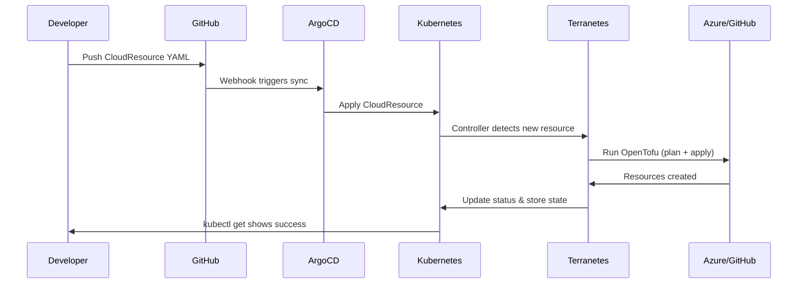

# LAB05: Infrastructure as Code with OpenTofu and Terranetes

Welcome to LAB05! In this lab, you'll learn how to provision infrastructure across multiple cloud providers using OpenTofu (the open-source Terraform fork) and then evolve to a Kubernetes-native GitOps approach using Terranetes. By the end of this lab, you'll have:

- Deployed multi-provider infrastructure using OpenTofu (Azure + GitHub)
- Understood the strength of Infrastructure as Code for managing resources across providers
- Installed and configured Terranetes in your Kubernetes cluster
- Converted traditional IaC workflows to GitOps with Terranetes
- Implemented platform engineering patterns for self-service infrastructure
- Experienced Kubernetes-native infrastructure management

## Prerequisites

Before starting, ensure you have completed:
- **LAB01**: Your local environment should have:
  - Kind cluster running with NGINX ingress
  - ArgoCD installed and accessible
  - `kubectl` configured and working
- **LAB03**: Azure integration with:
  - Azure CLI installed and configured
  - Azure Service Principal created (we'll reuse this)
  - Azure subscription access

**Additional Requirements for this lab:**
- **GitHub Account**: With a Personal Access Token (we'll create this)
- **OpenTofu**: We'll install this in Part 1
- **Basic terminal/shell knowledge**: For running commands

## Overview

In previous labs, we used Azure Service Operator (ASO) to manage Azure resources through Kubernetes. In this lab, we'll explore a different approach: **Infrastructure as Code (IaC)** with OpenTofu and **Terranetes**.

### Why OpenTofu?

OpenTofu is an open-source fork of Terraform, maintained by the Linux Foundation. It provides:
- **Multi-Provider Support**: Manage resources across Azure, GitHub, AWS, GCP, and 1000+ providers
- **Declarative Configuration**: Describe your desired state, let the tool figure out how to get there
- **State Management**: Track what resources exist and their current configuration
- **Plan Before Apply**: Preview changes before making them

### Why Terranetes?

Terranetes (by Appvia) brings Terraform/OpenTofu into Kubernetes:
- **GitOps Native**: Infrastructure changes flow through Git, just like applications
- **Kubernetes-Native**: Manage infrastructure using familiar kubectl commands
- **Self-Service**: Developers can request infrastructure through Kubernetes resources
- **Policy Enforcement**: Platform teams can control what infrastructure is allowed
- **State Management**: State is stored securely in Kubernetes secrets

## Part 1: Prerequisites and OpenTofu Setup

### Verify Azure CLI Authentication

We'll reuse the Azure setup from LAB03:

```bash
# Verify you're logged in to Azure
az account show --output table

# If not logged in, run:
# az login

# Verify your subscription
az account list --output table

# Set your preferred subscription if needed
# az account set --subscription "YOUR_SUBSCRIPTION_ID"
```

### Create GitHub Personal Access Token

For OpenTofu to create GitHub repositories, you need a Personal Access Token:

1. Go to https://github.com/settings/tokens
2. Click **"Generate new token"** → **"Generate new token (classic)"**
3. Give it a descriptive name: `opentofu-workshop`
4. Set expiration: 7 days (or your preference)
5. Select scopes:
   - `repo` (Full control of private repositories)
   - `delete_repo` (Delete repositories) - for cleanup
6. Click **"Generate token"**
7. **Copy the token immediately** - you won't see it again!

```bash
# Set the GitHub token as an environment variable
export GITHUB_TOKEN="ghp_your_token_here"

# Verify it's set
echo "Token is set: ${GITHUB_TOKEN:0:10}..."
```

**Important**: Keep this token secure. Never commit it to Git!

### Install OpenTofu

#### macOS
```bash
# Using Homebrew (Recommended)
brew install opentofu

# Verify installation
tofu version
```

#### Windows
```powershell
# Using Chocolatey
choco install opentofu

# Or using Scoop
scoop install opentofu

# Verify installation
tofu version
```

#### Linux
```bash
# Using the install script (Recommended)
curl --proto '=https' --tlsv1.2 -fsSL https://get.opentofu.org/install-opentofu.sh -o install-opentofu.sh
chmod +x install-opentofu.sh
./install-opentofu.sh --install-method standalone
rm install-opentofu.sh

# Verify installation
tofu version
```

### Verification Steps - Part 1

```bash
# Verify Azure CLI is authenticated
az account show --query name -o tsv

# Verify GitHub token is set
[ -n "$GITHUB_TOKEN" ] && echo "GitHub token is set" || echo "GitHub token is NOT set"

# Verify OpenTofu is installed
tofu version

# Verify your Kind cluster is running (from LAB01)
kubectl cluster-info
```

**Expected Output:**
- Azure CLI shows your subscription name
- GitHub token confirmation message
- OpenTofu version (e.g., `OpenTofu v1.6.0`)
- Kubernetes cluster info showing your Kind cluster

### Reflection Questions - Part 1

1. **Token Security**: Why do we use environment variables for sensitive tokens instead of putting them in configuration files?

2. **OpenTofu vs Terraform**: Why might an organization choose OpenTofu over Terraform? What are the implications of the licensing change?

3. **Multi-Provider Strategy**: We're going to manage both Azure and GitHub resources. What other providers might be useful in a platform engineering context?

## Part 2: Understanding OpenTofu and Multi-Provider IaC

### The Power of Multi-Provider Infrastructure

One of OpenTofu's greatest strengths is managing resources across multiple providers in a single configuration. In this lab, we'll create:

- **Azure Resources**: A Resource Group (foundation for other Azure resources)
- **GitHub Resources**: A repository for storing code or configuration

This demonstrates how a single IaC tool can orchestrate your entire infrastructure, regardless of where it lives.

### Examine the OpenTofu Configuration

Let's look at the OpenTofu templates provided in the `lab05/opentofu/` directory:

```bash
# Navigate to the lab05 directory
cd lab05/opentofu

# List the configuration files
ls -la
```

The configuration consists of several files:

| File | Purpose |
|------|---------|
| `versions.tf` | OpenTofu version requirements and provider versions |
| `providers.tf` | Provider configurations (Azure, GitHub) |
| `variables.tf` | Input variable definitions with validation |
| `main.tf` | Resource definitions (what gets created) |
| `outputs.tf` | Output values (connection info, URLs) |
| `terraform.tfvars.example` | Example variable values |

### Review the Configuration Files

Take a moment to examine each file to understand how multi-provider IaC works:

- **versions.tf** - Specifies which providers and versions to use
- **providers.tf** - Configures how to authenticate with each provider
- **variables.tf** - Defines inputs with validation and defaults
- **main.tf** - The actual resources to create
- **outputs.tf** - Information to display after deployment

### Key Concepts

1. **Providers**: Plugins that know how to interact with APIs (Azure, GitHub, AWS, etc.)
2. **Resources**: The infrastructure components you want to create
3. **Variables**: Inputs that make your configuration reusable
4. **Outputs**: Values to display or use in other configurations
5. **State**: OpenTofu tracks what it created so it can update or destroy resources

### Reflection Questions - Part 2

1. **Provider Authentication**: Looking at `providers.tf`, how does OpenTofu authenticate with Azure vs GitHub? What are the differences?

2. **Resource Dependencies**: In `main.tf`, the GitHub repository doesn't depend on the Azure Resource Group. What if you needed to pass Azure information to GitHub (like a resource ID)?

3. **Variable Validation**: Look at the `environment` variable validation. Why is this useful? What other validations might you add?

4. **State Importance**: OpenTofu stores state about your infrastructure. What happens if you lose the state file? How would you recover?

## Part 3: Deploy Infrastructure with OpenTofu

Now let's deploy real infrastructure using OpenTofu.

### Configure Your Variables

First, create your configuration file:

```bash
# Navigate to the opentofu directory
cd ~/platform-engineering-workshop/lab05/opentofu

# Copy the example configuration
cp terraform.tfvars.example terraform.tfvars

# Edit the configuration with your values
# Use your preferred editor (nano, vim, code, etc.)
```

Edit `terraform.tfvars` with your specific values:

```hcl
# Azure Configuration
resource_group_name = "rg-yourname-workshop-dev"
location            = "swedencentral"
environment         = "dev"
project_name        = "platform-workshop"

# GitHub Configuration  
github_repo_name        = "yourname-workshop-infra"
github_repo_description = "Infrastructure repository created by OpenTofu workshop"
github_repo_visibility  = "public"  # Use "private" if you prefer
```

**Important**: Replace `yourname` with your actual name or initials to ensure unique resource names.

### Initialize OpenTofu

Initialize downloads the providers and prepares the working directory:

```bash
# Initialize OpenTofu
tofu init

# You should see output showing providers being downloaded
```

**Expected Output:**
```
Initializing the backend...
Initializing provider plugins...
- Finding hashicorp/azurerm versions matching "~> 4.0"...
- Finding integrations/github versions matching "~> 6.0"...
- Installing hashicorp/azurerm v4.x.x...
- Installing integrations/github v6.x.x...

OpenTofu has been successfully initialized!
```

### Validate the Configuration

Before deploying, validate that your configuration is correct:

```bash
# Validate syntax and configuration
tofu validate

# Format the code (optional, but good practice)
tofu fmt
```

### Plan the Deployment

The plan shows what OpenTofu will create, modify, or destroy:

```bash
# Generate and display an execution plan
tofu plan
```

**Review the plan carefully!** You should see:
- 1 Azure Resource Group to create
- 1 GitHub Repository to create

The plan will show all the attributes that will be set on each resource.

### Apply the Configuration

Now let's create the resources:

```bash
# Apply the configuration
tofu apply
```

OpenTofu will show the plan again and ask for confirmation:
```
Do you want to perform these actions?
  OpenTofu will perform the actions described above.
  Only 'yes' will be accepted to approve.

  Enter a value: yes
```

Type `yes` and press Enter to proceed.

### Verify the Deployment

After successful deployment, OpenTofu displays the outputs:

```bash
# View the outputs
tofu output

# View specific outputs
tofu output azure_resource_group_name
tofu output github_repository_url
```

Verify in Azure:
```bash
# List resource groups matching your name
az group list --output table | grep workshop

# Show details of your resource group
az group show --name rg-yourname-workshop-dev --output table
```

Verify in GitHub:
```bash
# Open your new repository in a browser
# Or use GitHub CLI if installed:
gh repo view yourname-workshop-infra --web
```

### View State

OpenTofu stores state locally by default:

```bash
# List resources in state
tofu state list

# Show details of a specific resource
tofu state show azurerm_resource_group.main
tofu state show github_repository.main
```

### Verification Steps - Part 3

```bash
# Verify OpenTofu state shows 2 resources
tofu state list | wc -l
# Should output: 2

# Verify Azure Resource Group exists
az group show --name $(tofu output -raw azure_resource_group_name) --query name -o tsv

# Verify GitHub Repository exists (via API)
curl -s -H "Authorization: token $GITHUB_TOKEN" \
  "https://api.github.com/repos/$(tofu output -raw github_repository_full_name)" | jq .name

# Check outputs are available
tofu output
```

**Expected Output:**
- State contains 2 resources
- Azure Resource Group name matches your configuration
- GitHub repository name is returned
- All outputs display URLs and resource information

### Reflection Questions - Part 3

1. **Multi-Provider Deployment**: With one `tofu apply`, you created resources in both Azure and GitHub. How does this compare to using separate tools for each platform?

2. **State File**: Look at the `terraform.tfstate` file (don't modify it!). What information does it contain? Why is this important?

3. **Idempotency**: Run `tofu plan` again without making changes. What does it show? Why is this behavior useful?

4. **Drift Detection**: If someone manually changed your Azure Resource Group tags in the portal, what would happen on the next `tofu plan`?

5. **Destroy Capability**: You could run `tofu destroy` to remove everything. How does OpenTofu know what to destroy?

## Part 4: Install and Configure Terranetes

Now that you've experienced traditional OpenTofu deployment, let's bring this workflow into Kubernetes using Terranetes.

### What is Terranetes?

Terranetes is a Kubernetes controller that:
- Runs Terraform/OpenTofu inside your cluster
- Stores state in Kubernetes secrets
- Enables GitOps workflows for infrastructure
- Provides self-service infrastructure through Kubernetes resources

### Install Terranetes Controller

```bash
# Add the Terranetes Helm repository
helm repo add appvia https://terranetes-controller.appvia.io
helm repo update

# Install Terranetes controller
helm install -n terraform-system terranetes-controller appvia/terranetes-controller \
  --create-namespace

# Wait for the controller to be ready
kubectl rollout status deployment/terranetes-controller -n terraform-system
```

### Verify Terranetes Installation

```bash
# Check the controller is running
kubectl get pods -n terraform-system

# Check Terranetes CRDs are installed
kubectl get crd | grep terraform

# You should see CRDs like:
# configurations.terraform.appvia.io
# providers.terraform.appvia.io
# revisions.terraform.appvia.io
# cloudresources.terraform.appvia.io
```

### Install Terranetes CLI (Optional but Recommended)

The `tnctl` CLI provides helpful commands for working with Terranetes:

#### macOS
```bash
brew install appvia/tap/tnctl

# Verify installation
tnctl version
```

#### Windows
```powershell
# Download the latest release
# Go to https://github.com/appvia/terranetes-controller/releases
# Download tnctl-windows-amd64.exe
# Rename to tnctl.exe and add to your PATH

# Or using Scoop (if available)
scoop bucket add appvia https://github.com/appvia/scoop-bucket
scoop install tnctl

# Verify installation
tnctl version
```

#### Linux
```bash
curl -sL https://github.com/appvia/terranetes-controller/releases/latest/download/tnctl-linux-amd64 -o tnctl
chmod +x tnctl
sudo mv tnctl /usr/local/bin/

# Verify installation
tnctl version
```

### Configure Azure Provider for Terranetes

Create a Kubernetes secret with Azure credentials:

```bash
# Get your Azure credentials from LAB03 or create new ones
# You'll need: subscription_id, tenant_id, client_id, client_secret

# Create the Azure credentials secret
kubectl create namespace terraform-deployments

# Create secret with your Azure Service Principal credentials
kubectl create secret generic azure-credentials \
  --namespace terraform-deployments \
  --from-literal=ARM_SUBSCRIPTION_ID="$(az account show --query id -o tsv)" \
  --from-literal=ARM_TENANT_ID="$(az account show --query tenantId -o tsv)" \
  --from-literal=ARM_CLIENT_ID="YOUR_CLIENT_ID" \
  --from-literal=ARM_CLIENT_SECRET="YOUR_CLIENT_SECRET"
```

**Note**: Replace `YOUR_CLIENT_ID` and `YOUR_CLIENT_SECRET` with your Service Principal credentials from LAB03.

Now create the Provider resource:

```bash
# Navigate to the terranetes configuration directory
cd ~/platform-engineering-workshop/lab05/terranetes

# Apply the Azure provider configuration
kubectl apply -f provider-azure.yaml

# Verify the provider was created
kubectl get providers.terraform.appvia.io
```

### Configure GitHub Provider for Terranetes

Create a secret for GitHub authentication:

```bash
# Create GitHub credentials secret
kubectl create secret generic github-credentials \
  --namespace terraform-deployments \
  --from-literal=GITHUB_TOKEN="$GITHUB_TOKEN"

# Apply the GitHub provider configuration
kubectl apply -f provider-github.yaml

# Verify both providers exist
kubectl get providers.terraform.appvia.io
```

### Verification Steps - Part 4

```bash
# Verify Terranetes controller is running
kubectl get pods -n terraform-system
# Should show terranetes-controller-xxx running

# Verify CRDs are installed
kubectl get crd | grep -c terraform.appvia.io
# Should show 4 or more CRDs

# Verify providers are configured
kubectl get providers.terraform.appvia.io
# Should show azure-provider and github-provider

# Check provider status
kubectl describe provider azure-provider | grep -A5 "Status:"
kubectl describe provider github-provider | grep -A5 "Status:"
```

**Expected Output:**
- Terranetes controller pod running (1/1 Ready)
- Multiple Terranetes CRDs installed
- Both azure-provider and github-provider visible
- Provider status shows "Ready" or similar healthy state

### Reflection Questions - Part 4

1. **Controller Pattern**: Terranetes uses the Kubernetes controller pattern. How does this differ from running `tofu apply` manually?

2. **Credential Management**: We stored Azure and GitHub credentials in Kubernetes secrets. How does this compare to environment variables? What are the security implications?

3. **Provider Resources**: Why do we create Provider resources separately from the actual infrastructure? What flexibility does this provide?

4. **Namespace Isolation**: We created a `terraform-deployments` namespace for our credentials. How could you use namespaces for multi-tenant infrastructure?

## Part 5: GitOps Infrastructure with Terranetes

Now let's deploy the same infrastructure (Azure Resource Group + GitHub Repository) through Terranetes.

### Understanding Terranetes Resources

Terranetes uses several custom resources:

| Resource | Purpose |
|----------|---------|
| **Provider** | Defines credentials and authentication for a cloud provider |
| **Configuration** | A single infrastructure deployment (like one `tofu apply`) |
| **Revision** | A versioned template that others can use (platform template) |
| **CloudResource** | An instance of a Revision (developer's infrastructure request) |

### Create an Infrastructure Revision

A Revision is a reusable template. Platform teams create Revisions, developers use them:

```bash
# Navigate to the terranetes directory
cd ~/platform-engineering-workshop/lab05/terranetes

# Apply the infrastructure revision
kubectl apply -f infrastructure-revision.yaml

# Check the revision was created
kubectl get revisions.terraform.appvia.io
```

### Deploy Infrastructure Using CloudResource

Now create a CloudResource that uses the Revision:

```bash
# First, customize the deployment values
# Edit cloudresource-example.yaml with your preferred names

# Apply the CloudResource
kubectl apply -f cloudresource-example.yaml

# Watch the deployment progress
kubectl get cloudresources.terraform.appvia.io --watch
```

### Monitor the Deployment

Terranetes runs OpenTofu inside a Kubernetes job:

```bash
# Check the CloudResource status
kubectl describe cloudresource workshop-infra -n terraform-deployments

# Watch the terraform job
kubectl get jobs -n terraform-deployments --watch

# View the terraform execution logs
kubectl logs -n terraform-deployments -l terraform.appvia.io/configuration=workshop-infra -f
```

### Verify Terranetes Deployment

```bash
# Check CloudResource status
kubectl get cloudresource workshop-infra -n terraform-deployments -o yaml | grep -A10 "status:"

# The status should show:
# - conditions showing success
# - outputs with resource information

# Verify in Azure
az group list --output table | grep terranetes

# Verify in GitHub (check for the new repository)
```

### Verification Steps - Part 5

```bash
# Verify Revision exists and is ready
kubectl get revisions.terraform.appvia.io

# Verify CloudResource was created and deployed
kubectl get cloudresources.terraform.appvia.io -n terraform-deployments

# Check for successful status
kubectl get cloudresource workshop-infra -n terraform-deployments \
  -o jsonpath='{.status.conditions[?(@.type=="Ready")].status}'
# Should output: True

# Verify the Azure resource was created
az group list --output table | grep -i terranetes

# Check terraform state is stored in Kubernetes
kubectl get secrets -n terraform-deployments | grep tfstate
```

**Expected Output:**
- Revision shows as available
- CloudResource status is Ready=True
- Azure Resource Group exists with Terranetes naming
- A tfstate secret exists in the namespace

### Reflection Questions - Part 5

1. **Kubernetes Native**: How does having infrastructure as a Kubernetes resource change your workflow? What tools can you now use?

2. **State in Secrets**: Terranetes stores state in Kubernetes secrets. What are the pros and cons vs remote state backends like Azure Storage?

3. **Revision Pattern**: The Revision acts as a template. How is this similar to Helm charts or KRO ResourceGroups from LAB04B?

4. **Controller Reconciliation**: What happens if someone deletes the Azure Resource Group manually? How would Terranetes respond?

5. **GitOps Integration**: How could you integrate this with ArgoCD? What would the workflow look like?

## Part 6: Platform Engineering Patterns

Let's explore how Terranetes enables self-service infrastructure in a platform engineering context.

### Pattern 1: Template-Based Infrastructure

Platform teams create Revisions (templates), developers consume them:

```yaml
# Platform team creates this once
apiVersion: terraform.appvia.io/v1alpha1
kind: Revision
metadata:
  name: team-infrastructure
spec:
  # Template configuration...
  
---
# Developer requests infrastructure
apiVersion: terraform.appvia.io/v1alpha1  
kind: CloudResource
metadata:
  name: my-team-infra
spec:
  revisionRef:
    name: team-infrastructure
  variables:
    team_name: "my-team"
    environment: "dev"
```

### Pattern 2: Policy-Based Credential Injection

Use policies to automatically inject credentials based on namespace labels:

```bash
# Apply the GitHub policy
kubectl apply -f github-policy.yaml

# This policy automatically provides GitHub credentials
# to any namespace labeled with: terranetes.appvia.io/github-token: "true"
```

### Pattern 3: Namespace-Based Multi-Tenancy

Each team gets their own namespace with appropriate credentials:

```bash
# Create a team namespace
kubectl create namespace team-alpha

# Label it for GitHub access
kubectl label namespace team-alpha terranetes.appvia.io/github-token=true

# Team can now create CloudResources that use GitHub
```

### Pattern 4: ArgoCD Integration

You can manage Terranetes resources through ArgoCD:

```yaml
# ArgoCD Application for infrastructure
apiVersion: argoproj.io/v1alpha1
kind: Application
metadata:
  name: team-infrastructure
  namespace: argocd
spec:
  project: platform-infrastructure
  source:
    repoURL: https://github.com/your-org/infrastructure.git
    path: teams/alpha
  destination:
    server: https://kubernetes.default.svc
    namespace: team-alpha
```

### Self-Service Workflow

The complete self-service workflow:



### Verification Steps - Part 6

```bash
# Verify policy is applied
kubectl get policies.terraform.appvia.io

# Check namespace labels
kubectl get namespace terraform-deployments --show-labels

# Verify self-service capability
# A user could now create a CloudResource in their namespace
```

### Reflection Questions - Part 6

1. **Self-Service Benefits**: How does this self-service model improve developer experience compared to ticket-based infrastructure requests?

2. **Guardrails**: Platform teams need to prevent developers from creating expensive or insecure resources. How would you implement guardrails with Terranetes?

3. **Cost Management**: How would you track which team is responsible for which infrastructure costs?

4. **Disaster Recovery**: If your Kubernetes cluster is lost, how would you recover the infrastructure state? What about the actual cloud resources?

5. **Multi-Cloud**: We focused on Azure and GitHub. How would you extend this pattern to include AWS or GCP resources?

## Troubleshooting

### Common Issues and Solutions

#### Issue: OpenTofu Init Fails

```bash
# Check your network connection
curl -I https://registry.terraform.io

# Clear the plugin cache and retry
rm -rf .terraform
tofu init
```

#### Issue: Azure Authentication Fails

```bash
# Verify Azure CLI login
az account show

# Re-login if needed
az login

# Check Service Principal credentials
az ad sp show --id YOUR_CLIENT_ID
```

#### Issue: GitHub Token Invalid

```bash
# Verify token is set
echo $GITHUB_TOKEN

# Test token with API call
curl -H "Authorization: token $GITHUB_TOKEN" https://api.github.com/user

# Generate a new token if expired
# https://github.com/settings/tokens
```

#### Issue: Terranetes Controller Not Starting

```bash
# Check controller logs
kubectl logs -n terraform-system deployment/terranetes-controller

# Check for resource issues
kubectl describe pod -n terraform-system -l app.kubernetes.io/name=terranetes-controller

# Verify Helm installation
helm status terranetes-controller -n terraform-system
```

#### Issue: CloudResource Stuck in Pending

```bash
# Check the CloudResource status
kubectl describe cloudresource <name> -n <namespace>

# Look for the terraform job
kubectl get jobs -n <namespace>

# Check job logs
kubectl logs -n <namespace> job/<job-name>

# Common causes:
# - Provider credentials incorrect
# - Revision not found
# - Resource already exists in cloud
```

#### Issue: State Lock Issues

```bash
# If terraform state is locked, check for running jobs
kubectl get jobs -n terraform-deployments

# Force unlock (use with caution!)
# Delete the job and the CloudResource will retry
kubectl delete job <job-name> -n terraform-deployments
```

## Cleanup (Optional)

If you want to clean up all resources created in this lab:

### Clean Up Terranetes Resources

```bash
# Delete CloudResources (this destroys the cloud infrastructure)
kubectl delete cloudresource --all -n terraform-deployments

# Wait for resources to be destroyed
kubectl get cloudresource -n terraform-deployments --watch

# Delete Revisions
kubectl delete revision --all

# Delete Providers
kubectl delete provider --all

# Delete Policies
kubectl delete policy --all

# Uninstall Terranetes
helm uninstall terranetes-controller -n terraform-system
kubectl delete namespace terraform-system
kubectl delete namespace terraform-deployments
```

### Clean Up Traditional OpenTofu Resources

```bash
# Navigate to OpenTofu directory
cd ~/platform-engineering-workshop/lab05/opentofu

# Destroy resources (this will prompt for confirmation)
tofu destroy

# Clean up local files
rm -f terraform.tfstate terraform.tfstate.backup tfplan
rm -f terraform.tfvars  # Keep the example file
```

### Verify Cleanup

```bash
# Verify Azure resources are deleted
az group list --output table | grep workshop

# Verify GitHub repositories are deleted
# Check https://github.com/YOUR_USERNAME?tab=repositories
```

## Next Steps

Congratulations! You now have:
- ✅ OpenTofu installed and configured for multi-provider infrastructure
- ✅ Deployed Azure and GitHub resources using traditional IaC
- ✅ Terranetes controller installed in your Kubernetes cluster
- ✅ GitOps workflow for infrastructure via Terranetes
- ✅ Understanding of platform engineering patterns for self-service infrastructure

### Key Takeaways

From this lab, you should understand:

1. **Multi-Provider IaC**: OpenTofu can manage resources across any provider from a single configuration
2. **State Management**: State tracking is essential for IaC to know what exists and what changed
3. **Kubernetes-Native IaC**: Terranetes brings IaC into Kubernetes, enabling GitOps workflows
4. **Self-Service Infrastructure**: CloudResources provide a developer-friendly API for infrastructure
5. **Platform Patterns**: Revisions, Policies, and namespaces enable scalable platform engineering
6. **GitOps Everything**: Infrastructure can flow through the same Git workflows as applications

## Resources and Further Learning

- [OpenTofu Documentation](https://opentofu.org/docs/)
- [Terranetes Documentation](https://terranetes.appvia.io/)
- [Azure Provider Documentation](https://registry.terraform.io/providers/hashicorp/azurerm/latest/docs)
- [GitHub Provider Documentation](https://registry.terraform.io/providers/integrations/github/latest/docs)
- [GitOps Principles](https://opengitops.dev/)
- [Platform Engineering Guide](https://platformengineering.org/)

### Useful Commands Reference

```bash
# OpenTofu Commands
tofu init              # Initialize working directory
tofu validate          # Validate configuration
tofu plan              # Preview changes
tofu apply             # Apply changes
tofu destroy           # Destroy resources
tofu state list        # List resources in state
tofu output            # Show outputs

# Terranetes Commands
kubectl get providers.terraform.appvia.io       # List providers
kubectl get revisions.terraform.appvia.io       # List revisions
kubectl get cloudresources.terraform.appvia.io  # List cloud resources
kubectl get configurations.terraform.appvia.io # List configurations
tnctl describe cloudresource <name>             # Detailed view (if CLI installed)

# Debugging
kubectl logs -n terraform-system deployment/terranetes-controller
kubectl describe cloudresource <name> -n <namespace>
kubectl get jobs -n <namespace>
```
